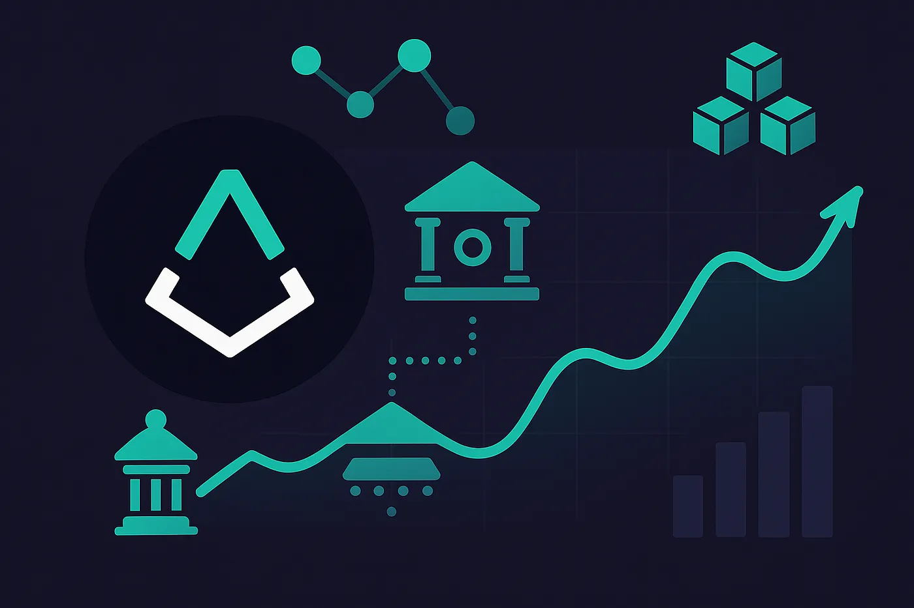
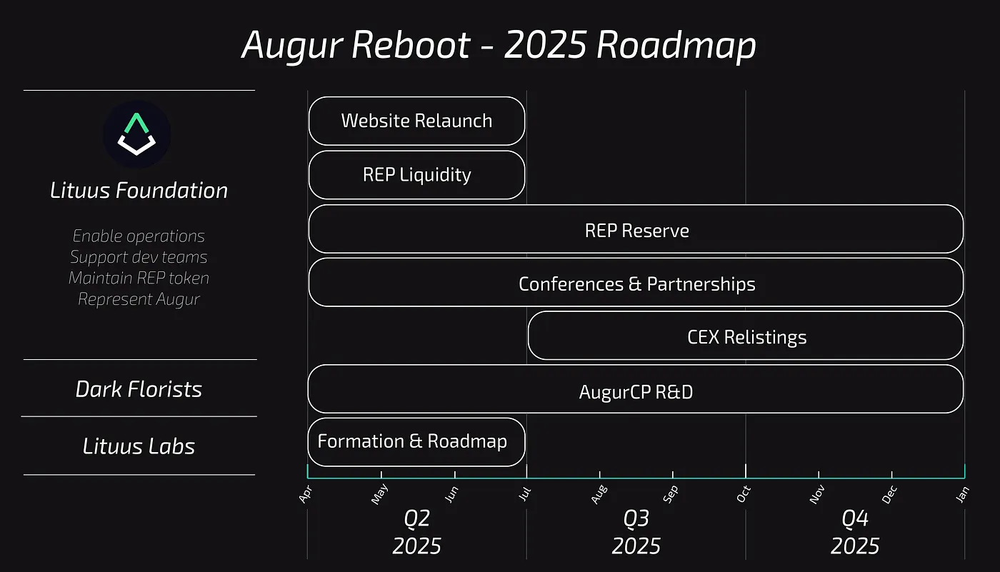

GM. If you haven't heard, Augur is back!

We are Lituus Foundation — long-time Augur community members entrusted with the protocol's treasury to revive the decentralized oracle that first brought crypto prediction markets to life.

If you missed the initial announcement, you can read it here:
[(https://x.com/AugurProject/status/1900288560789684341)](https://x.com/AugurProject/status/1900288560789684341)

Today, we're excited to present our 2025 Roadmap.
This will roughly define our short-medium-long term efforts and give the community a chance to comment on the approach.

## 🌀Lituus Foundation

The role of the foundation will be to enable operations, support the 2 dev teams, maintain a healthy token, and be the public face of Augur.

**Q2: REP Liquidity**

REP is a forking token — its security relies on active participants being able to acquire and stake REP when needed. A healthy, liquid market makes that possible. At some point, holders may need to act to defend the oracle or risk being burned - REP is not a passive investment.
To support this, the foundation will source more on-chain liquidity for the token.

**Q2-Q4: REP Reserve**

The foundation's current REP holdings are too low to unconditionally defend the oracle.
As the party with the strongest long-term stake, we intend to correct this by gradually increasing our position.

**Q2: Website Relaunch**

Augur.net's content is outdated and currently redirects to the github.
That's changing. We're rebuilding the site to clearly explain Augur's mission, architecture, and future.

**Q2-Q4: Conferences & Partnerships**

Augur's design is cypherpunk to the core — permissionless, trustless, immutable, and censorship-resistant. These values matter more than ever, especially in today's climate.
The foundation will represent Augur at major events to highlight its uniqueness and find aligned partners.

**Q3-Q4: CEX Relistings**

REP was once listed across nearly all major centralized exchanges — only Kraken remains today.
As momentum builds, the foundation will pursue (re)listings to make Augur accessible to broader communities.

## 🧠 Dark Florists

Dark Florists is one of two dev teams reviving Augur, tasked with Ethereum Mainnet deployment. They're led by well-known builders in the space and have full autonomy over their track.

**Q2-Q4+: AugurCP R&D**

DF will ship [AugurCP](https://listed.to/authors/33689/posts/51143) on Eth mainnet
Development happens fully in public — join the [#dev channel on Discord](https://discord.com/invite/Y3tCZsSmz3) to follow progress, ask questions, or get involved.

## ⚙️ Lituus Labs

Lituus Labs is the second core engineering team, focused on modernizing Augur and bringing it to an L2. This includes rethinking UX, oracle speed, and broader usability for a new wave of prediction apps.

We're still building out the team and advisory board — currently hiring two solid contract engineers.
If you're a badass dev looking to get involved in something important:
→ Discord: [@AugusLSN](https://x.com/AugusLSN)

**Q2: Lituus Labs Announcement & Roadmap**

The first look at our roadmap is coming soon. Stay tuned.

## 🔮 Looking Ahead

Augur has always been a bold idea — a decentralized truth machine.

The protocol works. What it needs now is stewardship, modernization, and momentum.

Lituus Foundation is here to provide exactly that — supporting both dev teams, reestablishing REP as a functional utility token, and rebuilding the public infrastructure around Augur.

This roadmap is a starting point, not a fixed path. We're here to listen, build in public, and adjust based on what the oracle — and its community — needs most.

If you're aligned with the mission, come get involved:
Join the [Discord](https://discord.com/invite/Y3tCZsSmz3), follow [@AugurProject](https://x.com/AugurProject), or reach out directly.

Let's Make Augur Great Again.
