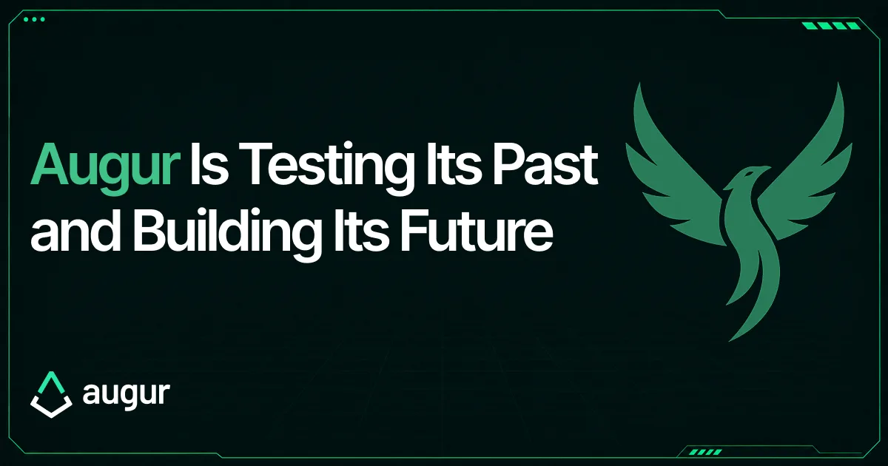

*Three things are happening at once: the Moon Fork is running live, Augur Lituus has moved into development, and the Foundation is backing a second attempt at the resolution problem.*

Augur has spent long stretches out of the news. Three things are happening at once.

The Moon Fork is live. For the first time in the protocol's history, Augur's fork mechanism is running as the dispute process of last resort, and participants are making choices with their own tokens on the line. Holders of REP, the protocol's dispute token, are inside the migration window, and what they do before August 1, 2026, matters.

At the same time, Augur Lituus, the redesigned oracle we published as a whitepaper in January, has moved from research into development, with ChainSafe now engineering the implementation. It returns to the problem Augur has worked on from the beginning: establishing the truth of real-world events without a central authority empowered to decide it on everyone's behalf. This time the mechanism is rebuilt for prediction platforms and other applications beyond Augur itself.

The Foundation is also backing a second attempt at the problem: Dark Florist, an independent team working on a censorship-resistant prediction market and its own line of oracle research.

Everything else here is context for those three facts, and the context starts with the question Augur was built around: when someone stands to profit from the wrong answer, who decides what actually happened?

## The resolution problem

Prediction markets get discussed as forecasting tools, and forecasting is the visible part: the odds and the crowd signal behind them. Underneath sits a plainer requirement. When the event is over, the market has to pay someone, which means something has to establish what occurred.

For small markets this is unremarkable. A team checks the evidence, a committee decides, token holders vote, a multisig signs off. The sums are modest and the answers usually obvious. The process rarely comes under serious adversarial pressure.

Scale changes that. Once a market is worth enough, manipulating the resolution can become more profitable than trading on the correct outcome: an attacker can buy the side that should lose, then try to make the process say it won. Every sharp corner starts to matter: ambiguous wording, conflicting sources, edge cases, public pressure, arguments made in bad faith.

None of this is theoretical anymore, and it is not any one platform's failing; the pressure shows up wherever the stakes get high enough, which lately has meant the largest venue, because that is where the volume concentrates. The three episodes below all come from Polymarket for that reason, and in each one the strain fell on the same place: the resolution process, which the venue delegates to a third-party oracle whose token holders vote on disputed outcomes.

In July 2025, a market on whether Ukraine's president would wear a suit, a question that drew more than $150 million in trading volume, flipped from Yes to No through a vote of the oracle's token holders despite substantial media coverage pointing the other way ([Wired](https://www.wired.com/story/volodymyr-zelensky-suit-polymarket-rebellion/) chronicled the episode). In May 2026, a [Wall Street Journal](https://www.wsj.com/finance/polymarket-bet-disputes-fb1b8c6a) review of the venue's disputes found that in nearly one of every five, accounts helping decide the outcome were tied to bets in the very market they were ruling on. And in June 2026, Strategy's first disclosed bitcoin sale since 2022 threw a market then worth $14 million into a resolution fight over whether the sale date or the disclosure date should control who gets paid ([CoinDesk](https://www.coindesk.com/markets/2026/06/01/strategy-s-bitcoin-sale-sparks-a-usd14-million-crypto-betting-chaos-on-a-major-prediction-market)); the ruling has since been challenged in court by traders on the losing side. The markets and the questions differed; the weak point, every time, was resolution.

Augur has been working on that weak point for over a decade. The project, a decentralized prediction market protocol on Ethereum, held one of the network's first crowdsales in 2015 and launched on mainnet in 2018. It was built on a position that was radical then and remains rare now: no company or committee should hold the final word on who won. Disputed outcomes would be settled through an open economic process instead, with participants staking value on competing answers and losing it when they backed the wrong one. Stewardship of the protocol has changed hands over the years, and today the work is funded and coordinated by the Lituus Foundation, writing here. The position has not changed.

The original design got a great deal right and some things wrong, and an honest accounting of which is which could only come from running it in public. That accounting is what the current work is built on.

## The Moon Fork

The fork is the mechanism of last resort in Augur v2, the version of the protocol running today; it predates Augur Lituus and is separate from it. It is the final stage of the dispute process, reached when an ordinary dispute escalates past every earlier round. The protocol splits into parallel universes, one for each possible outcome, and every REP holder must migrate their tokens to the universe they believe reflects reality. Migration is one-way. The result is a public record of where participants placed economic weight when it counted most. It is also where the protocol's economic security comes from. An attacker who pushed a dispute this far ends up holding tokens in the universe that does not reflect reality, and as honest holders migrate to the one that does, the economic value of the system moves with them and away from the attacker.

Until this year, that mechanism had never fired. That changed on April 8, 2026, with a market asking whether NASA's Artemis II mission would successfully lift off: the Moon Fork, as it has come to be known, is the mechanism's first live use. The fork did not arrive by accident. Augur developer Micah Zoltu set up a crowdsourcing contract to fund the dispute, and existing REP holders contributed roughly 200,000 REP knowing the tokens would be spent, precisely so the community could watch the mechanism run end to end. The dispute split Augur into child universes, one for each possible outcome, Yes, No, and Invalid, and REP holders are migrating into the one they believe reflects reality. The mission did launch successfully; what the fork tests is not the outcome but whether the mechanism itself performs under real conditions.

Audits examine code and simulations examine assumptions, but neither shows how people actually behave when a live mechanism cannot be paused or quietly corrected, and when their own tokens are what move. To our knowledge, no comparable decentralized oracle has carried a dispute process of this kind through a live fork. Whatever the Moon Fork reveals about how participants coordinate, and about the gap between design and behavior, will be evidence we believe the category has not produced before.

It also asks something concrete of REP holders; the details are in the migration section below.

## Augur Lituus

Augur Lituus is the next version of the design.

The [whitepaper](https://github.com/AugurProject/whitepaper/blob/master/Lituus/English/Augur_Lituus_Whitepaper.pdf) proposes a decentralized resolution layer: a system that prediction markets, protocols, and applications can call on when a real-world outcome is disputed and no operator should hold final authority. Prediction markets are the obvious customer, but the need is general. A platform should not have to become the judge each time a contentious outcome lands on an edge case, nor the party users blame and threaten when the payout rides on the ruling. The design is meant to sit underneath such platforms rather than compete with them.

The paper pairs the design with a comparative analysis of oracle security: what it would cost, under stated assumptions, to force a fraudulent outcome through each major class of decentralized oracle. In that analysis, the new design raises the estimated attack cost to 134% of the oracle's fully diluted valuation, from roughly 92% under [Augur v2's mechanism](https://github.com/AugurProject/whitepaper/releases/latest/download/augur-whitepaper-v2.pdf). On the whitepaper's assumptions, forcing a false outcome through Augur Lituus means buying up and destroying more than half the token supply, and then, once the protocol mints a replacement supply, buying into the fresh pool a second time. The assumptions are published alongside the results so readers can change the inputs and judge whether the conclusion survives.

This post is not the full case for Augur Lituus. The whitepaper covers the mechanism and the analysis in detail, and we plan to publish a plain-language walkthrough of how it works on this blog soon.

## Dark Florist

Separately, the Foundation funds Dark Florist, an independent team building a censorship-resistant prediction market: a trading venue in its own right, designed so that no gatekeeper can remove markets or exclude participants. The team pursues its own oracle research as well.

That effort follows its own design path and is best read as its own project rather than a component of Augur Lituus. The Foundation is funding more than one attempt at the problem of how markets establish disputed facts, on the view that a question this hard deserves more than one answer.

## From whitepaper to implementation

ChainSafe is engineering the Augur Lituus implementation; the Foundation reviews the work to keep the code faithful to the mechanism the whitepaper describes. Progress is public in the [Lituus-CS repository](https://github.com/AugurProject/Lituus-CS). A whitepaper does not resolve markets by itself; the design has to be implemented, tested, audited, documented, and made usable by the applications that would depend on it. That work should move carefully. A resolution system earns its keep only in the moments when the outcome is contentious and the incentives are hostile.

We know REP holders will ask what Augur Lituus means for them. That is part of the work now underway, and we will address it directly in a future post. It changes nothing about the deadline below.

## If you hold REP

Migrate before August 1, 2026. REP that has not migrated by then is expected to be left outside the active Augur system and may lose economic value.

Migration tooling is available at [6.augurfork.eth.limo](https://6.augurfork.eth.limo/#/migration). Migrating means choosing a universe; the [migration guide](https://www.augur.net/learn/fork/migration/) on the Augur website walks through the decision, and the [FAQ](https://www.augur.net/faq/) covers common questions. Exchange support status is tracked on [ForkWatch](https://v3.augur.net/#exchange-support).

If your REP sits on an exchange, confirm that the exchange has announced fork support. If it has not, withdraw and migrate on-chain yourself. Do not assume an exchange will handle migration for you.

And be careful where you click. Migration periods attract impersonators: fake support accounts, cloned websites, phishing messages, wallet-draining links. The official sources are exactly the ones linked in this section, along with the Augur [Discord](https://discord.gg/Y3tCZsSmz3) and [@AugurProject](https://x.com/AugurProject) on X. They span more than one domain, so check addresses character by character and treat everything else with suspicion. No one from Augur or the Foundation will contact you first about your migration, and no legitimate process will ever ask for your seed phrase or private keys.

## Where this leaves Augur

Strip away the history and the mechanism design. What remains is the argument Augur has made for a decade: that the weakest point of any prediction market is the moment someone declares what happened, and that no single party should be the one holding that pen. This year, the argument is being made in two concrete ways at once.

The first is evidence. REP holders are advised to migrate by August 1, 2026. By that point, we believe the Moon Fork will have produced a public record the category hasn't had before, a fork-based dispute process carried through to its end, under live incentives, by the people with the most at stake. What it shows about how participants actually behave when the mechanism cannot be paused will inform everything built after it.

The second is construction. Augur Lituus is moving through implementation with ChainSafe and the Foundation, at the pace careful oracle engineering demands, and the work is fully open source, developed in a public repository where anyone can follow or audit the progress. Dark Florist continues on its own track, also building in the open. Between them, the Foundation is backing the infrastructure answer and the user-facing one.

If you hold REP, your part in this is specific and it has a date: migrate before August 1, 2026.

Our part is the build, and it is happening now. Every commit lands in public in [the repository](https://github.com/AugurProject/Lituus-CS), and we look forward to showing you what takes shape there.

*Read the [Augur Lituus whitepaper](https://github.com/AugurProject/whitepaper/blob/master/Lituus/English/Augur_Lituus_Whitepaper.pdf). Join the conversation on [Discord](https://discord.gg/Y3tCZsSmz3) and follow [@AugurProject](https://x.com/AugurProject).*
