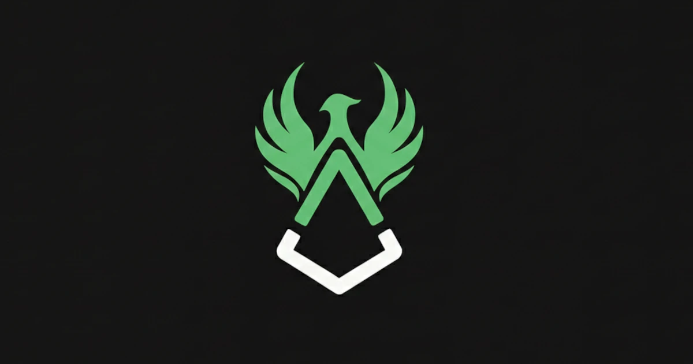

Three months into Augur’s revival, here’s where we are — and where we’re headed next.

## 🔥 Q1 Summary

It’s been an exciting first quarter since we announced the revival of Augur, and we’ve been hard at work rebuilding the foundations of decentralized truth. Here’s a quick look at what we’ve accomplished so far and what’s coming next!

In April, we laid out a roadmap to:

🟣 Support the REP token

🟣 Restart core R&D

🟣 Establish a presence at major events

🟣 Launch foundational infrastructure, including a revamped website

We’re proud to say we’ve made significant strides across all of these areas, and there’s much more to come.

## 📈 Liquidity & Token Support

**Summary:**

The Foundation doubled its REP holdings and deployed capital to kickstart on-chain liquidity. We’re on track to expand this, and next quarter, we’ll begin the important work of relisting REP on centralized exchanges.

**This quarter:**

- Doubled the Foundation’s REP holdings: 250k → 550k REP
- Seeded a $100k Uniswap v3 pool to support DEX liquidity

**Next quarter:**

- Continue strengthening REP’s on-chain liquidity
- Begin outreach to centralized exchanges

REP is not just a token — it’s Augur’s security backstop. A liquid market means that when it’s time to defend the oracle, participants can act quickly and effectively. Lituus is committed to making REP broadly accessible again.

## 🌍 Presence & Ecosystem Growth

**Summary:**

This quarter, we’ve reintroduced Augur to the ecosystem, rekindling old relationships and building new ones. The excitement surrounding Augur’s return has been reassuring — there’s a real hunger for decentralized, trustless systems. We’ll build on this momentum in the coming months.

**This quarter:**

Attended 3 major crypto conferences to represent Augur
Built strong relationships with key opinion leaders (KOLs) and ecosystem players who are excited to support the relaunch

**Next quarter:**

Continue attending events and growing our ecosystem presence
Increase our reach and share our vision with the world: podcasts, X Spaces, community calls, AMAs — wherever we can engage and inspire
People remember what made Augur special, and they’re excited to see it evolve. The conversations we’ve had this quarter are just the beginning.

## 🧪 Research & Development

**Summary:**

This quarter started with solid momentum — The Dark Florists were making great progress with AugurCP. However, a critical flaw was discovered in the v2 game theory, which shifted our focus back to deep research. Both teams have been working closely to rethink the oracle from first principles, pushing the boundaries of what’s possible.

**This quarter:**

- AugurCP development began with strong progress
- Paused after discovering a key game-theoretic issue in v2
- Entered full research mode, with Lituus Labs and Dark Florists working together to propose new oracle models
- 298 [GitHub commits](https://github.com/AugurProject/Augur-Constant-Product-Market), [15+ design drafts](https://github.com/AugurProject/Research-2025), and over 10,000 messages exchanged in Augur’s Discord research channels

**Next quarter:**

- Continue refining and testing competing oracle models
- Publish our research for public review and invite feedback from the community
- Work toward a merged architecture that balances robustness with usability

Decentralized oracles are a hard problem, and next quarter will focus mostly on research. Lituus Labs remains fully committed to delivering a generalized Augur, and while the teams have followed different paths so far, we are optimistic that our research will converge. That said, we are fully prepared to continue pushing forward independently if that leads us to the best possible outcome.

## 🔮 Looking Ahead

It’s been a foundational quarter — rebuilding infrastructure, re-engaging with the ecosystem, and tackling some tough challenges head-on. The road ahead is long, but real progress is being made, and we’re accelerating toward our vision.

If you’ve been watching from the sidelines, now is the perfect time to get involved. Join us in building something that lasts. Together, we’re redefining what’s possible for decentralized truth.

→ Join the [Discord](https://discord.com/invite/Y3tCZsSmz3)
→ Follow [@AugurProject](https://x.com/AugurProject) on X

Let’s make an unstoppable truth machine.

— The Lituus Foundation
