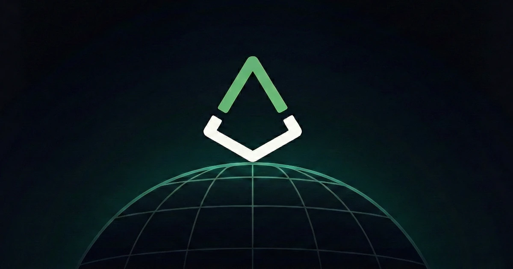

*Six months in, our footing is solid and it's time to start turning up the volume*

## 🔥 Q2 Summary

Q2 was shaped by two big themes: advancing oracle research and moving towards testing its ultimate defense mechanism: the fork.

**Highlights this quarter:**

- **Website:** Launched https://augur.net
- **Oracle research**: Progressed along two complementary streams, one focused on consumer prediction markets and the other on enterprise-grade oracle use cases (More detail in a dedicated post soon)
- **Fork experiment**: Community developer **Micah Zoltu** launched a [crowdsourcer](https://3.go-fund-micah.eth.limo/blog.html) to deliberately trigger the first algorithmic token fork in crypto, a bold test of Augur's core security model
- **REP support:** Expanded buyback to 1M REP
- **Ecosystem presence:** Attended conferences, and participated in numerous X spaces

Momentum is building on every front, Augur is waking up.

## ⚖️ Highlight of the Quarter: Micah's Fork

- A fork is Augur's ultimate backstop: when disputes escalate to the threshold, REP holders must migrate to defend truth
- Micah Zoltu launched a [crowdsourcer](https://3.go-fund-micah.eth.limo/index.html) to raise the necessary funds to trigger the fork
- The crowdsourcer is **38% funded**. If completed, it would be a rare, live demonstration of Augur's security model in action
- The Foundation is not participating, but we view this as a fascinating experiment that highlights Augur's resilience and permissionless design

👉 Read the [full post on the fork here](https://medium.com/p/0a1494868d97)

## 📈 Liquidity & Token Support

**Summary**

REP continues to be strengthened as the backbone of Augur's oracle. We expanded the Foundation's holdings this quarter, laying the groundwork for long-term liquidity support and oracle security. CEX relistings remain a priority, but are paused until the fork path is clear.

**This quarter**

- Expanded buyback up to 1M REP total
- Maintained Uniswap liquidity
- Explored treasury staking options (including Uniswap v2) and decided on stETH

**Next quarter**

- If the crowdsourcer does not fill, we will plan towards CEX engagement in Q4

REP must remain liquid and widely accessible, forming the foundation of Augur's economic defense.

## 🌍 Presence & Ecosystem Growth

**Summary**

We've been working hard to expand Augur's presence, both digitally and in-person. From launching our new website to attending conferences and engaging on social channels, Augur is being reintroduced to a new generation of builders and users.

**This quarter**

- Launched the new [Augur website](https://augur.net)
- Participated in multiple X Spaces
- Attended multiple conferences to get the word out and build partnerships

**Next quarter**

- Scale up community calls, podcasts, and AMAs
- Accelerate our presence on X and explore other channels to raise awareness
- Continue attending and speaking at key industry events

Next quarter will mark a major push in growth, PR, and marketing to set the stage for the whitepaper.

## 🧪 Research & Development

**Summary**

Our research efforts continue to advance along two streams: Lituus Labs is moving closer to development, while the Dark Florists remain in deep research. We'll dive into these tracks in a dedicated post soon, but both aim to capture B2C and B2B opportunities, unified under Augur's generalized vision and the REP token.

**This quarter**

- Continued parallel R&D with Lituus Labs and Dark Florists
- Dark Florists pivoted to an exciting and unique new design
- Maintained a "unified REP" direction
- Drafted and reviewing core sections of the Lituus whitepaper
- 219 [GitHub commits](https://github.com/AugurProject), multiple new [design drafts](https://github.com/AugurProject/oracle-research), and 13,000+ messages in Discord research channels

**Next quarter**

- Release the first version of the Lituus whitepaper for community review
- Continue toward a merged architecture
- Share more details on how Augur will serve both consumer and enterprise markets

Decentralized oracles remain one of crypto's hardest problems. Both teams are working hard towards that goal.

## 🔮 Looking Ahead

Q2 brought key pieces together and gave us a strong foundation, from deep research progress to expanded REP support and stronger ecosystem presence. With the whitepaper nearing release, the stage is set for the next phase.

Q3 will be about **clarity, education, and amplification —** making sure the space understands what we're building, why it matters, and how Augur's oracle can power the new wave of prediction markets.

Rather than competing with them, we aim to be the infrastructure they build on. The shovels and picks in the coming gold rush of prediction markets.

We're just getting started.

→ [Join the Discord](https://discord.com/invite/Y3tCZsSmz3)

→ Follow [@AugurProject](https://x.com/AugurProject) on X

**— The Lituus Foundation**
