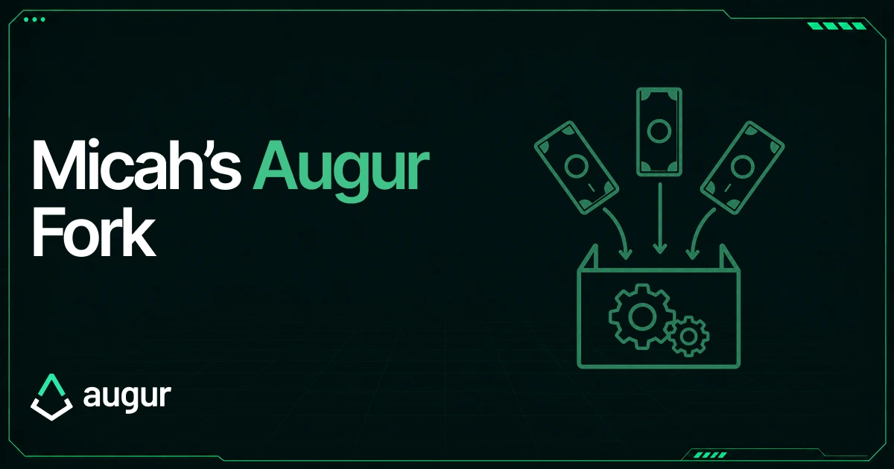

*Community member and current Augur developer **Micah Zoltu** has launched a [crowdsourcer](https://3.go-fund-micah.eth.limo/blog.html) to attempt triggering an Augur fork. Here's what that means for REP holders and what to expect.*

**Update (Oct 2025): Crowdsourcer filled and there will be a fork.**

## ⚖️ What is Augur's fork?

**A fork is Augur's final backstop — a resolution mechanism that codifies the social defence.** When disputes escalate to the threshold (2.5% of total REP staked), the system splits into parallel universes, one for each possible outcome. REP holders must then choose which universe to move forward with, and migrate their REP to that universe — in practice, we expect no trading to occur in the universe built on a lie, and so the REP migrated there to be worthless.

There are two stages:

1. **Dispute game (~2 months):** REP is staked back and forth on outcomes until the threshold is hit. If the threshold is never reached, the last undisputed outcome becomes final — and those who backed it earn a 40% ROI.

2. **Fork (60 days):** If the threshold is reached, the universe splits, markets become duplicated, and every REP holder must **migrate** their tokens to the universe they believe reflects reality.

If you don't migrate within the 60-day fork window, **your REP is permanently stuck in the old universe.**

The fork ensures Augur always resolves to the truth — by requiring all REP holders to participate. **That's why REP is not a passive asset.**

## 💡 What is Micah's Crowdsourcer?

Micah's crowdsourcer is a **personal initiative** — separate from the Foundation — created to deliberately push Augur into a fork. The idea is simple: use pooled REP to fund the *lying side* of a market dispute.

By doing this, the dispute game is guaranteed to escalate all the way to the fork threshold. That leaves the *truthful side* open for anyone to stake on, earning the standard **40% ROI** in the process.

In short, the crowdsourcer sacrifices REP on one side so that Augur's fork mechanism can be activated, forcing all REP holders to migrate and reaffirm their commitment to the system.

Read Micah's [post](https://3.go-fund-micah.eth.limo/blog.html) for more information.

The link to the [crowdsourcer](https://3.go-fund-micah.eth.limo/index.html) to donate.

## 🏛️ Does Lituus support this initiative?

Yes. The Lituus Foundation supports the idea of strengthening Augur's economic security but will not participate in the crowdsourcer or the fork itself.

Augur is a **permissionless system** — anyone can build on it, test it, or run experiments like this fork. Independent efforts are part of how Augur remains resilient. As a legal entity, the Foundation must take a cautious stance, while community members like Micah are free to explore these mechanisms directly.

## 👨‍💻 Is Micah still developing for Lituus?

Yes. Augur development continues on both tracks, with Micah fully aligned with the Foundation. This fork effort runs in parallel — it is not in conflict with the Foundation's work.

## 💸 Should I donate REP?

It depends whether you:

1. Trust Micah
2. Believe a fork would benefit Augur
3. Have REP you are prepared to lose

**Donating is risky — contributed REP is sacrificed to push the fork forward.** Some holders speculate there could be indirect benefits: in theory, if a portion of REP holders fail to migrate, the relative share of those who do increases. For example, if 20% of REP went inactive, contributing up to that amount could leave you relatively better positioned after the fork.

However, this is only a theoretical outcome. There is **no guarantee** that inactive REP will remain unmigrated, or that donating will lead to a net benefit.

## 🔮 What should I expect?

**Step 1: As a REP holder**

- **Do nothing** → you rely on others to fund the fork
- **Donate some REP** → risky but may strengthen Augur

**Step 2: If you donate**

- **Withdraw before the 200k target** → you recover your REP
- **Stay in until target is hit** → REP is sent to Micah; Micah uses it to push a market into a fork

**Step 3: Dispute phase (~2 months)**

- Micah stakes on one side designed to lose
- With your **remaining** REP, you can:
  - **Do nothing**
  - **Stake on the truthful side** → 40% ROI

**Step 4: Fork begins (60-day window)**

- Migration tool opens to the new REP
- **You must migrate within 60 days**, or your REP is permanently stuck in the old universe

## 👉 Bottom line

This fork is an independent community experiment, not a Foundation initiative. If it happens, every REP holder must act — **migration is mandatory.**

The security of a fork comes from every REP holder participating to align the system around reality through open economic choice. It shows how the Augur oracle can resolve to truth without relying on vetoes, multisigs, or centralized backstops — a form of security unique to forking tokens, and one worth demonstrating to the space.

Thanks for reading, and we would love for you to join the community:

→ [Join the Discord](https://discord.gg/Y3tCZsSmz3)
→ Follow [@AugurProject](https://x.com/AugurProject) on X

**— The Lituus Foundation**
