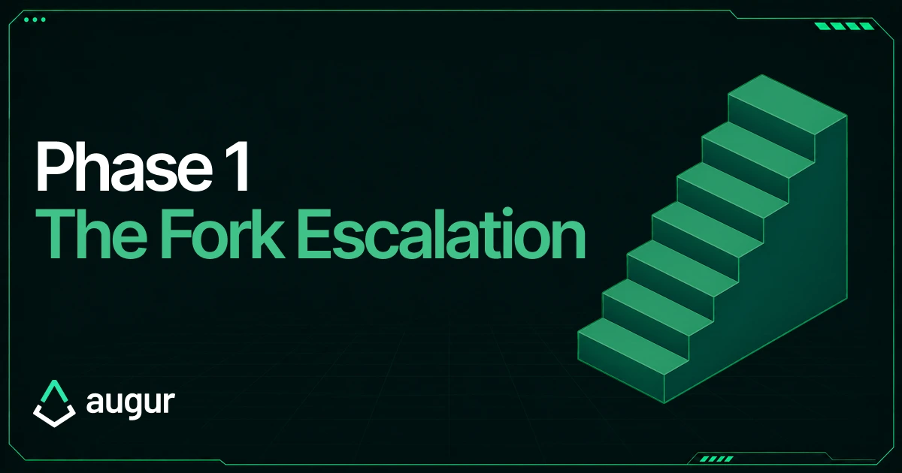
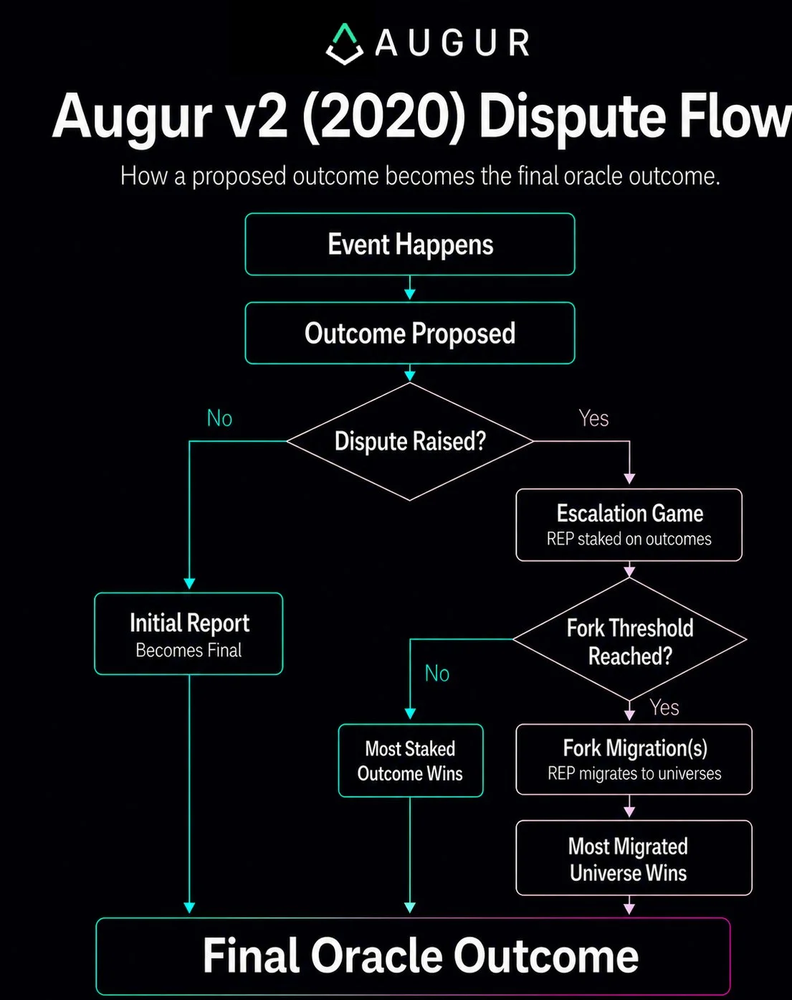
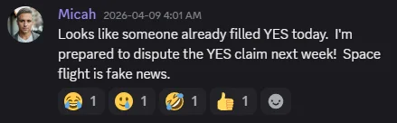
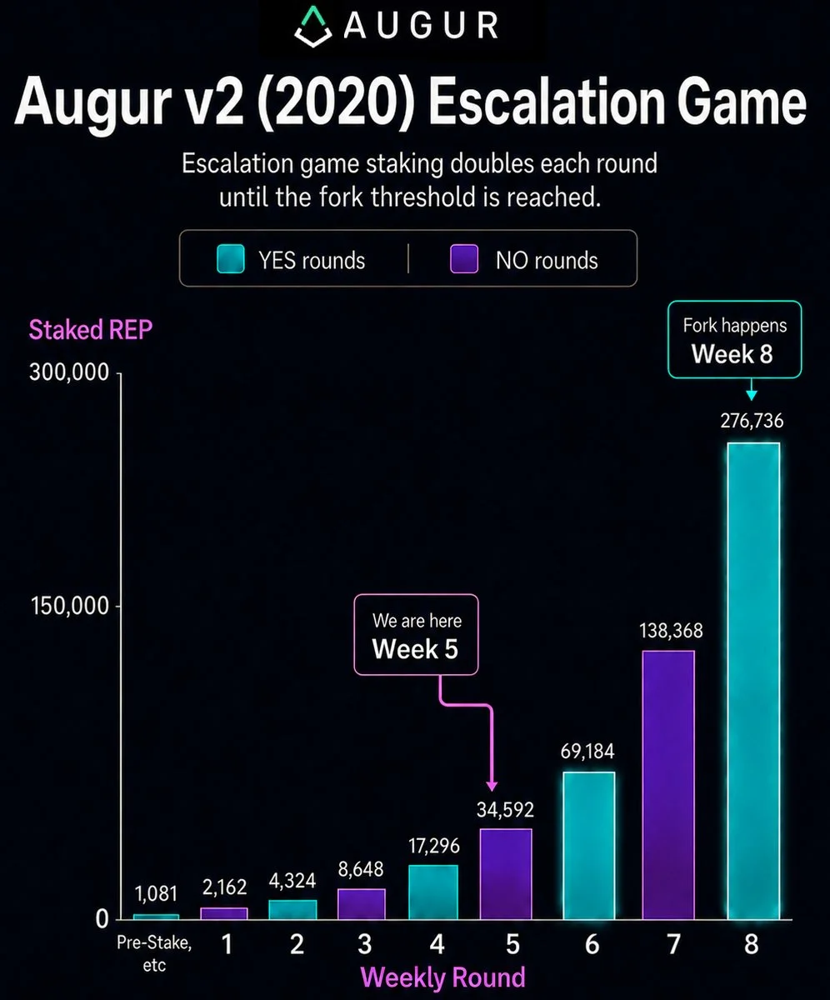
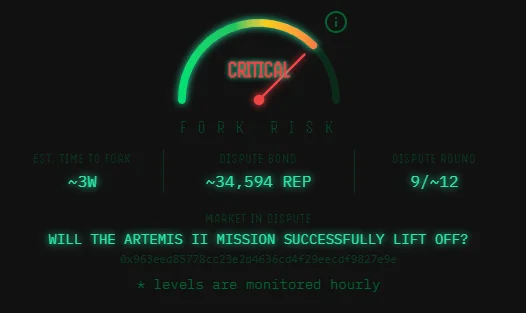

Did the Artemis II Mission successfully liftoff in the first week of April?

Augur is undergoing an end-to-end test of its 2020 dispute mechanism, including the fork backstop. Future Augur implementations will differ from Augur v2 (2020), but this test demonstrates the core escalation-and-fork pattern that has always made Augur distinct.

The benefit of Augur is that it doesn't require any layered security councils, token votes, multisigs, or vetoes. It's a permissionless incentive design that's open for anybody to participate in, and roughly works by making truth profitable.

This is important because prediction market resolution should be done in a way that doesn't require trusting any party to act honestly.

## So where are we?

In early [April](https://www.augur.net/blog/the-augur-fork-is-here/), [@MicahZoltu](https://x.com/MicahZoltu) triggered a dispute over the query:

> Will the Artemis II Mission successfully lift off in the first week of April?

This kicked off Augur's 2-phase design:

1. Escalation game (April - June)
2. Migration (Fork) (June - August ~6th)

We are currently in week 5/8 of the Escalation Game. Most oracle queries would have resolved by now, but Micah was clever and [crowdsourced](https://listed.to/authors/33689/posts/66981) enough funds to make it all the way to the fork.

Since the escalation game will be how most people interact with Augur during normal operation, this is a great opportunity to showcase it.

## Stake in the (Escalation) game

The game works by flipping outcomes back and forth until one side fails to raise an escalating amount of capital during its timed round. At that point, the oracle resolves to the undisputed outcome and pays a +40% return from the losers pot. (Some is burned)

The 40% profit motive makes it easier to fundraise against manipulation, because people are likelier to side with the truth. This pits an attacker, who has to stake their own capital on a blatant lie, against the entire open market that is trying to take their money.

The rounds don't go on forever though, because then an infinitely rich actor could always win with 0 cost. Instead, in a high-enough round, the protocol activates the fork backstop and changes its strategy from "Try to outspend the attacker" to "Make them lose as much as possible". But that's Phase 2 (which is 3 weeks away) and the content of a future post.

In practice, Augur v2 (2020) sets the parameters at 8 (minimum) weekly rounds with stakes escalating by 2x up to a 2.5% of REP supply fork threshold. These parameters will change in future versions.

With Micah having filled Round 5, any REP holders that wish to participate can fill Rounds 6 and 8 to take his money, which will trigger the fork in early June.

The escalation game makes gaming the oracle more expensive because you have to constantly put up money instead of just trying to convince a few large token/influence holders to side with you. It's a design that tries to transfer money from bad actors to good actors.

We hope this fork test will highlight why Augur needs to exist in the space. A pure-play decentralization option acts like a check on alternatives not to go overboard.

t-3 weeks.

---

To participate in the escalation game, visit [Forklift](https://6.augurfork.eth.limo/#/reporting?market=0x963eed85778cc23e2d4636cd4f29eecdf9827e9e).

Step-by-step guide: [Migration Guide](https://www.augur.net/learn/fork/migration/)

Join the [Discord](https://discord.com/invite/CdCSYk9GwH) to follow along with our open-source dev streams.

Decentralization.
