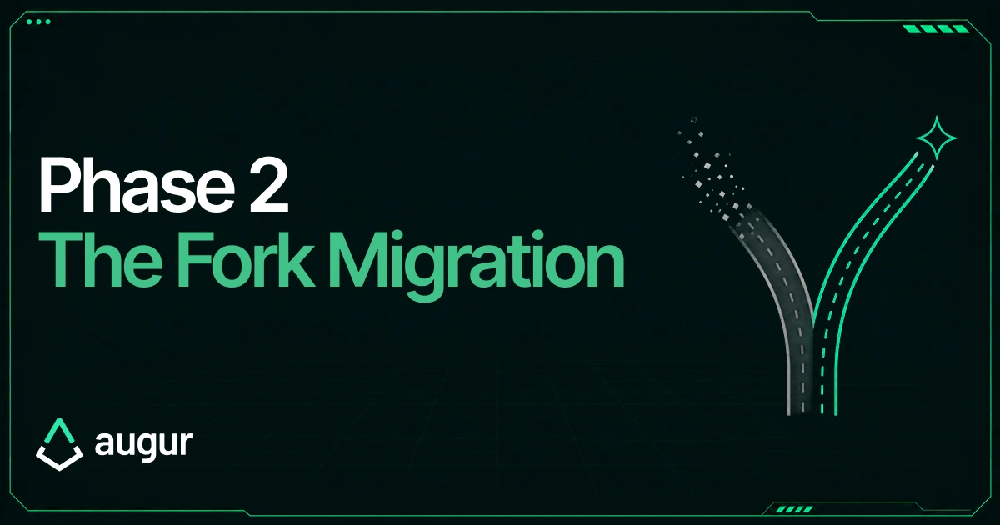
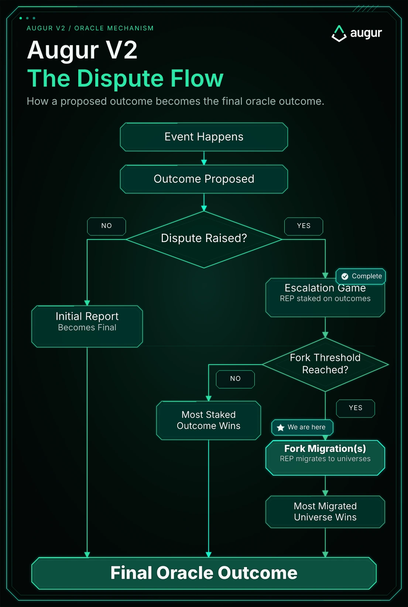
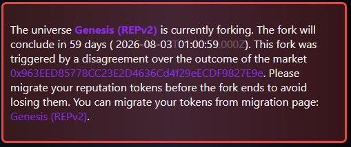
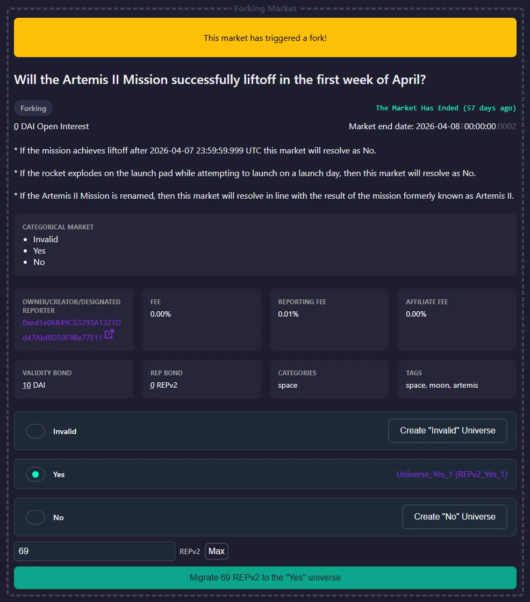
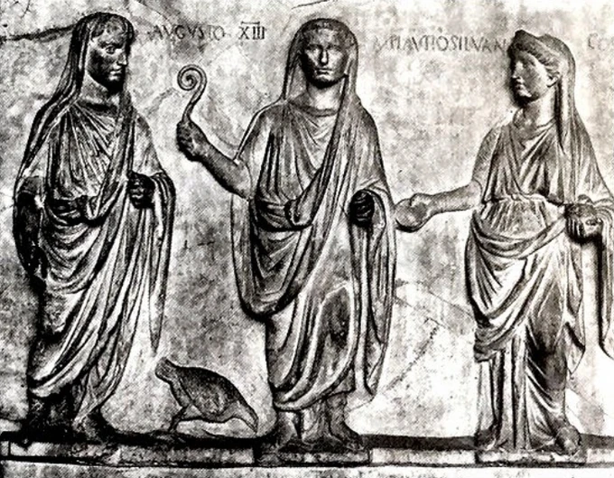

Did the Artemis II Mission successfully lift off in the first week of April?

Recent controversies have made one thing clear:

A prediction market is only as safe as the process that resolves it.

Not every market can be written perfectly in advance. But when criteria are ambiguous, the answer should come from a fair, standard process known ahead of time, not an improvised one after traders have already placed their bets.

Augur was built around that model: open economic incentives instead of discretionary intervention.

## TL;DR

Augur is testing its fork design and Phase 2 just started: a two-month migration to a new token.

All REP holders must migrate or be left behind with a worthless version of REP.

If you hold REP, migrate by August 3: [https://6.augurfork.eth.limo/#/migration](https://6.augurfork.eth.limo/#/migration)

The foundation has migrated its holdings and added liquidity to the new token: [REPv2_Yes_1 on Etherscan](https://etherscan.io/token/0xcf6a0a7826fa124b7705d6f3c675ead76f1e540d)

This is a test of Augur v2's 2020 dispute mechanism and a live demonstration of the escalation-and-fork design that future Augur systems, including Lituus, are currently building around.

This is what gives the protocol economic security: REP holders move value into the token corresponding with truth, while any attacker is left holding REP tied to a false outcome that the market should not value.

## So where are we?

In early [April](https://www.augur.net/blog/the-augur-fork-is-here/), [@MicahZoltu](https://x.com/MicahZoltu) triggered a dispute over the query:

> Will the Artemis II Mission successfully lift off in the first week of April?

This kicked off Augur's two-phase design:

1. Escalation game (April - June)
2. Migration / fork (June - August 3)

Phase 1 is now complete.

The Escalation Game did what it was supposed to do. REP was staked on competing outcomes, the rounds escalated, and enough capital was raised to push the system into the fork. The 40% incentive for raising capital was proven to be enough.

Now Phase 2 begins.

## What REP holders need to do

All REP holders and custodians must migrate during the June - August 3 window or risk being left behind with old REP that can no longer follow the active Augur system.

In practice:

If you hold REP in your own wallet, you need to migrate it yourself.

If you hold REP on an exchange, support is not guaranteed. Each exchange must decide whether and how to support migration for its users. Exchange support status changes frequently, so check the latest at [v3.augur.net/#exchange-support](https://v3.augur.net/#exchange-support).

If you are unsure, the safest path is to withdraw to your own wallet and complete the migration yourself.

## How to migrate

Migration tooling is available at: [https://6.augurfork.eth.limo/#/migration](https://6.augurfork.eth.limo/#/migration)

A step-by-step usage guide and FAQ are also available:

- [Migration Guide](https://www.augur.net/learn/fork/migration/)
- [FAQ](https://www.augur.net/faq/)

Before migrating, make sure you understand:

- Migration is 1:1.
- Migration is one-way.
- Migration is only available for two months, until August 3, 2026.
- Migration is required if you want your REP to remain part of the active Augur system.

For this fork, future official Augur development, funded by the Lituus Foundation, will continue on the token corresponding with the truthful outcome:

**Yes, the Artemis II Mission successfully lifted off in the first week of April.**

The prediction market platform that Dark Florist is currently developing will not support the legacy, unmigrated REPv2 token, but will support all branches of this fork.

## Fork Theory

The fork is the second phase and final backstop of Augur's dispute system.

During the [first phase](https://www.augur.net/blog/phase-1-the-escalation-game/), the protocol tries to resolve a dispute through escalating staking rounds. But escalation cannot continue forever, or the game becomes a contest of who has more money.

Once the fork threshold is reached, Augur changes strategy.

Instead of trying to outspend the attacker, it becomes about making them lose as much value as possible. The fight shifts to which outcome-specific REP token will carry Augur's future value and finalize markets going forward.

In a fork, REP splits into separate versions, one for each possible outcome. Rational REP holders migrate 1:1 into the version they believe future users, markets, developers, and fee activity will use. In most cases, that should be the truthful outcome, because truth is the strong Schelling point.

For an attacker to capture the vulnerable open interest, they have to make the false outcome win the migration game by acquiring and migrating 51% of REP to it.

After the attacker migrates, as long as nobody wants to use an attacker-controlled REP version moving forward, then their token loses all economic value and liquidity, leaving them stuck without a way to recoup their costs.

This is how the protocol creates economic security.

The attacker can only win the open interest by sacrificing the REP they used to win it. As long as the sacrificed REP is worth more than the open interest at risk, the attack is economically irrational.

You don't spend $2 to steal $1.

This security also propagates backward through the escalation game. Because the fork is waiting at the end, honest participants can fund earlier rounds knowing the attacker eventually faces a terminal cost, not just another chance to outbid them.

Ancient Roman Augurs

## Final Note

This fork is a live test of the mechanism Augur was built around.

Phase 1 showed the escalation game.

Phase 2 shows the fork.

Together, they demonstrate why Augur remains important: it is a pure-play decentralization option for resolving prediction markets without having to trust in anything except the open market.

Prediction markets need resolution systems that do not rely on committees, councils, vetoes, multisigs, post-hoc fixes, or social intervention when push comes to shove.

Unfortunately, these things typically don't matter. Until they do. You don't want to get caught with your pants down regretting all those smooth UX tradeoffs after your money is stolen by a corruptible design.

Thanks for reading.

Join the [Discord](https://discord.gg/CdCSYk9GwH) to follow along with our two open-source dev streams.

Website/blog: [https://www.augur.net/](https://www.augur.net/)

Decentralization.

— [@AugusLSN](https://x.com/AugusLSN), Lituus Foundation
