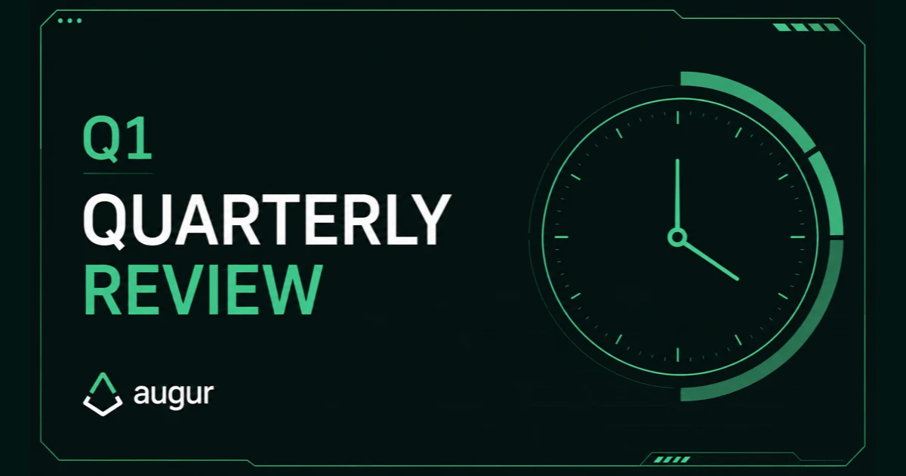

*The fork is live, migration is open, and REP holders need to act before the window closes.*

## 🔥 Q1 Fiscal Summary

### Summary

In the last update, Micah's fork was still ahead of us. Augur was preparing to enter its first live algorithmic fork: disputes would escalate through the onchain dispute process, the system would split into parallel universes if disagreement persisted, and holders would need to migrate to the universe they believed reflected reality.

This quarter, that sequence played out. The fork moved through the escalation phase, and Augur is now in the migration phase. There is now a deadline, and the Augur team has spent the quarter directing its efforts toward making the fork easier to follow: explaining what is happening, publishing migration resources, coordinating with custodians, and making clear what action holders need to take before the window closes.

The fork is the most urgent work in front of us, but it is not the only important work happening at Augur. We also partnered with ChainSafe to help build Augur Lituus, one of the next versions of Augur's oracle design. It builds on Augur's existing resolution mechanism and carries it forward into a new system design. Together with ChainSafe, we are moving that design from theory into implementation.

**Highlights this quarter:**

- The fork moved through the escalation phase and Augur entered the migration phase
- Augur partnered with ChainSafe to build Augur Lituus
- A professional PR firm was engaged to help increase fork awareness before the migration window closes
- Public development is now visible through the [Lituus-CS repository](https://github.com/AugurProject/Lituus-CS)
- The migration guide, migration site, and ForkWatch went live
- The Lituus Foundation team spoke with multiple exchanges about migration requirements

## ⚖️ The Fork & REP Migration

### Summary

During a fork, holders choose the universe they believe reflects reality by migrating REP into that universe, moving economic weight toward the truthful outcome. REP is not a passive asset: it secures Augur's oracle, and that role requires holders to participate when the system reaches this stage.

REP holders must migrate before **August 1, 2026**.

Tokens left in the old universe, or migrated into the wrong universe, may lose economic value. As the deadline gets closer, the public message has become simple: if you hold REP, migrate before the window closes.

### This quarter

We published the [migration guide](https://www.augur.net/learn/fork/migration/) and [migration site](https://6.augurfork.eth.limo/). [ForkWatch](https://v3.augur.net/) also went live as a public support page for the migration window, with fork status, migration progress, exchange-support list, and a tool to check whether an address holds REPv1 or REPv2.

For REP held on an exchange, the important question is how that custodian will support migration. Exchange handling can involve exchange-side migration, a user action through the exchange interface, withdrawals, or no support. The Foundation is working with exchanges to make direct or indirect migration support available where possible, but holders should not assume support until it is confirmed. If support is unclear, holders should consider withdrawing REP to a wallet they control and migrating through the official migration site.

### Next quarter

After the migration window closes, we will have a clearer picture of how much REP migrated, how holders and exchanges handled the window, and what the active post-fork REP set looks like.

## 🧪 Augur & ChainSafe

### Summary

The foundation partnered with ChainSafe to build Augur Lituus, using the whitepaper as the technical foundation. We are working closely with them to turn that architecture into protocol software, with their team focused on implementation while our team keeps the work consistent with the outlined design.

[Tweet announcement from @AugurProject](https://x.com/AugurProject/status/2048817619525083436)

The new design builds on Augur's fork-based oracle model. REP still sits at the center of the system: participants dispute proposed resolutions and, if a fork is triggered, migrate into the universe they believe reflects reality. The main changes are in the post-fork state, especially around active REP supply and attack resistance. We will soon publish a separate post explaining the whitepaper, the design changes, and why they matter.

Augur's development work continues across two parallel streams: Augur Lituus, focused on protocol and oracle infrastructure, and Dark Florists' oracle and prediction market product on the user-facing side.

### This quarter

Public development has started in the [Lituus-CS](https://github.com/AugurProject/Lituus-CS) repository.

Both development streams are fully open source, so progress can be followed directly as the Augur Lituus implementation and Dark Florists product work progress.

### Next quarter

Next quarter, the focus is to make the work easier to follow: continued implementation progress in the repository, and a more accessible written explanation for readers who want to understand Augur Lituus design without reading the full technical paper.

## 📈 Active REP & Oracle Security

### Summary

Migration also clarifies Augur's active security set.

Augur's oracle security depends on active REP participation. When disputes reach the fork stage, holders need to show up and migrate into the universe they believe reflects reality.

### This quarter

During the fork, active REP moves into the universe that holders believe should carry Augur forward. REP that does not migrate stays behind.

That matters because inactive REP weakens the oracle's security. During a fork, REP is supposed to move economic weight toward the universe that reflects reality. REP that stays idle does not perform that role, leaving less active capital defending the truthful outcome and lowering the cost of manipulation.

Migration makes the post-fork REP set explicit. REP that moves into the active universe can continue securing Augur and participating in future oracle work. REP left behind no longer plays that role and is expected to lose its value.

REP is not a passive investment.

### Next quarter

After the window closes, the post-fork REP supply should be easier to reason about because the active security set will be based on the REP that migrated.

## 🌍 Fork Awareness & Exchanges

### Summary

A lot of the work this quarter was simple, necessary, and easy to underestimate: do our best to reach REP holders, make it clear that the fork is live, and give them enough practical information to understand what they need to do.

### This quarter

At Consensus in Miami, the Lituus Foundation team spoke with multiple exchanges about migration support for REP held in custody. The conversations covered exchange-side migration, possible user-facing migration flows, and the technical or operational requirements each exchange needs before confirming a path.

We also published a series of blog posts on the [Augur website](https://augur.net) explaining the fork process as it unfolded. The first post, [The Augur Fork is Here](https://www.augur.net/blog/the-augur-fork-is-here/), announced that the fork had been triggered and explained what REP holders should expect; the second, [Phase 1: The Escalation Game](https://www.augur.net/blog/phase-1-the-escalation-game/), walked through the escalation game and why it matters to Augur's dispute mechanism; and the third, [Phase 2: The Fork Migration](https://www.augur.net/blog/phase-2-the-fork-migration/), explained the migration phase, official tooling, and what holders or custodians need to do now. This series was meant to make the fork easier to follow without requiring every holder to understand the full technical design, and to give clear, practical guidance so participants can navigate the process confidently and take the appropriate steps at each stage.

We are also working closely with a professional PR firm to help make sure the fork message reaches REP holders while there is still time to act. The goal is straightforward: get clear migration information in front of the people who need it, reduce confusion around the deadline, and make official links easier to find. We are treating fork awareness as a top priority and making a full push across every channel available to us so REP holders see the fork, understand the deadline, and migrate in time.

### Next quarter

Until August 1, outreach remains focused on migration. We will keep pushing reminders, exchange updates, and holder guidance while holders still need clear information and time to act.

## 🔮 Looking Ahead

### Summary

The next month is mostly about the fork.

That means being clear and repetitive where it helps: keep migration reminders visible, keep exchange information current, point people to official links, and reduce confusion.

After the migration window closes, we will publish a follow-up update with final migration numbers, exchange handling, the state of REP after the fork, and the next development milestones.

### Next quarter

The next update should have a clearer picture of where Augur stands after the fork: how much REP migrated, how exchanges handled the migration, and how Augur's development work is progressing in public. For now, the priority remains the same until the window closes: migrate REP, use official links, and do not wait until the final days.

## Join Us

→ [Discord](https://discord.com/invite/Y3tCZsSmz3)

→ [@AugurProject](https://x.com/AugurProject) on X

→ [Augur.net](https://www.augur.net)

**— The Lituus Foundation**
