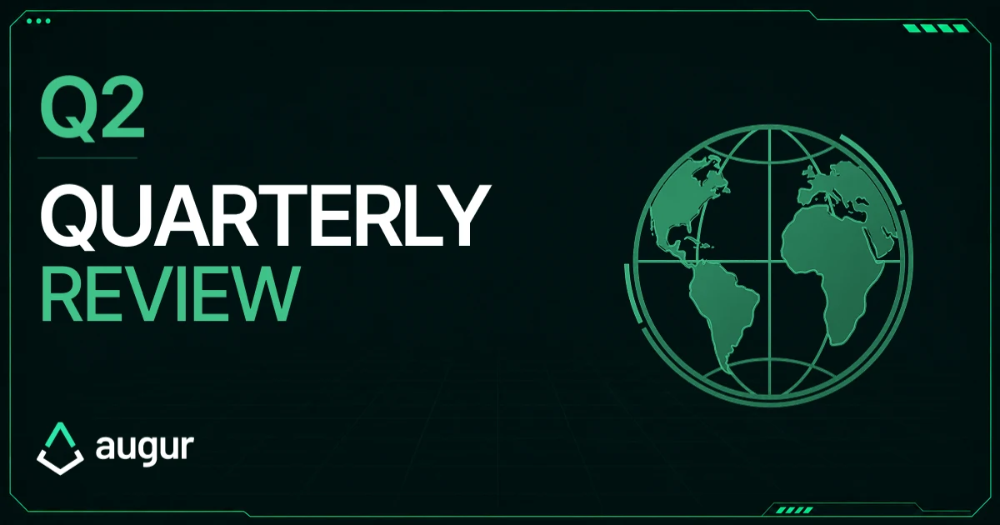

## Q2 Summary

When we published our last quarterly report, the migration window for Augur's first fork was still open. It closed on August 3, 2026, and the Yes universe was selected as the winner. Until then, nearly everything we did was about reaching REP holders and the exchanges holding REP for their customers. We published guides on the fork and how to migrate, engaged a PR firm to reach people beyond our own channels, coordinated directly with exchanges, and sent an ERC-20 notification token (informational only, not REP) to REPv1 and REPv2 holders. All of it was part of a wider effort to reach every holder we could before the deadline. Now that migration is closed, our focus is back on the larger goal: building oracle infrastructure for establishing truth onchain. Alongside development, we're working to make REP easier to access and track across platforms, and talking with exchanges and potential partners about the challenges the next iteration of Augur is designed to address.

**Highlights this quarter:**

- The Moon Fork concluded on August 3, with about 6.4 million REP migrated and the Yes universe winning
- Kraken listed REPv2_Yes_1 under the ticker AUGUR and migrated its customers' REPv1 and REPv2 balances
- OKX and Bitpanda also migrated their customers' balances to the Yes universe
- Blockchain explorers, wallets, portfolio trackers, and data platforms are being updated to display REPv2_Yes_1
- We started the process of getting a MiCA white paper for REPv2_Yes_1, an important step toward broader trading access in the European Economic Area (EEA)
- ChainSafe completed the first Augur Lituus implementation milestones, covering core oracle functions
- Dark Florist's independent oracle work moved forward, with continued funding from the Foundation

## The Moon Fork

### What happened

If you haven't followed the fork closely, here's the short version. A fork is Augur's last resort for settling a dispute. It's meant to be rare, and it only happens when earlier dispute rounds fail to resolve a market. If disagreement over an outcome escalates far enough, Augur splits into separate universes representing different outcomes, and REP holders choose between them by migrating their tokens. This is what gives the fork its strength: splitting into multiple universes moves economic value away from an attacker and lets the protocol keep functioning, even when an attacker pushes a false outcome through the dispute rounds. The Moon Fork was Augur's first, and our [case study](https://augur.net/learn/fork/moon-fork/) covers it in full. It began on April 8 with a disputed market asking whether NASA's Artemis II mission would successfully lift off in the first week of April. Longtime Augur community member Micah Zoltu started the dispute with a [crowdsourced](https://listed.to/authors/33689/posts/62531) pool of about 200,000 REP. After about eight weeks of escalating dispute bonds, the market reached the fork threshold and the 60-day migration window opened. When the window closed on August 3, the Yes universe held almost all of the migrated REP, and the protocol selected it as the winner. Artemis II did lift off, so Yes was the correct outcome. At no point could anyone pause the process or override the result.

The final numbers:

- Window closed: August 3, 2026, 01:00 UTC
- REPv2 migrated to the Yes universe: 6,398,081.41
- REPv2 migrated to the No universe: 1,786.23
- Total REPv2 migrated: 6,399,867.64, about 58.2% of the original 11 million REP supply
- About 4.6 million REP did not migrate into a child universe
- REPv2_Yes_1 total supply: 6,545,760.43 REP

### What it means

Augur's security relies on the fork as its final backstop. The mechanism is designed to make lying expensive: REP that backs a false outcome ends up in a separate universe, cut off from the one where Augur continues. The Moon Fork also made one thing clear: **REP is not a passive asset.** REP holders help protect the truth the oracle reports, and in a fork, migrating their REP is how they do it. It made that responsibility concrete for every holder. It's central to REP's utility: holders have a direct role in settling disputes and securing the oracle. Much of the practical difficulty was outside the protocol itself. The fork created a new token that wallets and other platforms didn't always recognize automatically, and each exchange had to decide how to handle its customers' balances. Reaching every REP holder we could was our main goal, and we did everything within our control to get there. This was a test of Augur v2, and it leaves Augur on stronger footing. The fork mechanism worked as designed on mainnet, from the first dispute to the final result, and we now have a playbook if a fork ever happens again. It also refreshed the holder base, since only REP that was actively migrated carries forward. And the relationships we built with custodians during the migration are now established, ready for any future fork.

## REP After the Fork

### Summary

REPv2_Yes_1 is the token of the winning universe and the token Augur Lituus will build on. Its contract address on Ethereum mainnet is [0xCf6A0A7826fa124B7705d6f3c675eAD76f1e540D](https://etherscan.io/token/0xCf6A0A7826fa124B7705d6f3c675eAD76f1e540D). From here on, REP refers to REPv2_Yes_1 unless we say otherwise. Kraken lists it under the ticker AUGUR, while its onchain symbol remains REPv2_Yes_1. The migration window closed permanently on August 3 and can't be reopened by anyone, including the Foundation. REPv1 and REPv2 that were not migrated are expected to become worthless, and any offer to migrate them now is not legitimate.

### Kraken lists the new token as AUGUR

Kraken's listing was a significant milestone this quarter, and the result of close coordination with Kraken's team throughout the fork. Beyond migrating its customers' REPv1 and REPv2 balances 1:1, the exchange made REP available for trading in supported regions. Kraken has been one of Augur's longest-standing exchange partners, including during the project's quieter years. As we highlighted in [our announcement on X](https://x.com/AugurProject/status/2079209259019989011?s=20), that relationship has continued through Augur's transition.

### Exchange support and platform updates

On July 30, [OKX and Bitpanda confirmed](https://x.com/AugurProject/status/2082881323677426038) they would also migrate their customers' balances to the Yes universe, so customers on all three exchanges didn't need to do anything themselves. Ahead of the deadline, we reached out to every exchange that listed REP, though not all of them chose to take part. [ForkWatch](https://v3.augur.net/#exchange-support), now a read-only archive, still shows what each one said during the window. REPv1 and REPv2 left on exchanges that didn't take part can't be migrated now either, and anyone who offers to do it should be treated as a scam.

Work to get REPv2_Yes_1 listed correctly began before the deadline and has continued since. Blockchain explorers, wallets, portfolio trackers, DEX interfaces, and market-data platforms don't always pick up a new contract address automatically, so each listing needs to be checked and updated. Many also needed the correct supply figure, or still showed old REPv1 or REPv2 listings that had to be retired. We've been going through them one by one. CoinGecko already shows REP correctly, and we're working with CoinMarketCap to update its listing.

### The MiCA white paper

For exchanges to offer REP in the European Economic Area (the EU plus Iceland, Liechtenstein, Norway and Canada), REP needs a MiCA white paper. MiCA, the EU's Markets in Crypto-Assets Regulation, sets common rules for crypto-assets across the region, and the white paper is a standardized disclosure that explains what a token is and what risks come with it. Without one, exchanges regulated under MiCA generally can't offer a token for trading. We've signed an agreement with a firm that specializes in these disclosures, and work on REP's white paper is underway. It's part of a broader effort to make REP more accessible, and the goal is to make it available to traders across the EEA, both on Kraken and on other exchanges that may choose to list it. We'll share updates as it moves forward.

### Next quarter

- Close out the remaining platform corrections
- Continue work on the MiCA white paper with the specialist firm

## Augur Lituus & ChainSafe

### Summary

We continue to work closely with ChainSafe on Augur Lituus, one of the next versions of Augur's oracle, following the design laid out in the [whitepaper](https://github.com/AugurProject/whitepaper/blob/master/Lituus/English/Augur_Lituus_Whitepaper.pdf). Development is fully open source, so anyone can follow along in the [Lituus-CS repository](https://github.com/AugurProject/Lituus-CS) without waiting for the next quarterly update. This quarter ChainSafe completed the first implementation milestones in July, establishing the core flow for submitting questions to the oracle, reporting answers, and resolving them. Testing has kept pace with development, growing from about 40 automated tests to more than 300 over the quarter across 22 merged pull requests. Since then, work has moved on to managing REP across universes and handling contested answers. The current focus is refining the dispute process and forking mechanisms. We also continue to support Dark Florist's independent work on oracle and prediction market infrastructure.

### Next quarter

- Continue implementation and testing, with dispute resolution and forking as the main focus
- Publish the plain-language walkthrough of Augur Lituus we've mentioned in earlier updates

## Presence & Ecosystem Growth

### Summary

With the fork complete, our communication is shifting from migration to explaining the work itself: the problems we're trying to address and why we're approaching them the way we are.

### This quarter

In July, [The Defiant](https://thedefiant.io/news/markets/augur-unveils-augur-lituus-to-solve-prediction-markets-biggest-unanswered-question) and [crypto.news](https://crypto.news/augur-returns-decentralized-layer-prediction-markets/) both covered Augur Lituus and one of the problems it's designed to address: settling a disputed prediction market outcome without a central authority holding the final say. The crypto.news piece also explained the Moon Fork to its readers while the window was still open. We also joined two long-form conversations. On [DevNTell](https://www.youtube.com/watch?v=zvOpooG2mFM), the discussion focused on why prediction market resolution is hard and where the Moon Fork and Augur Lituus fit in. In a live audio session hosted by Peanut Trade, the conversation started with how prediction markets work before turning to where they fall short. The team has been on the ground in Asia for ETHTokyo and Korea Blockchain Week, and will be at TOKEN2049 this month. The focus has been on meeting exchanges and potential partners and learning what projects need from resolution infrastructure.

### Next quarter

- Publish educational content on the limitations of existing resolution approaches
- Share regular updates on development and the reasoning behind it

## Looking Ahead

Much of what we've done since the Lituus Foundation took on stewardship of Augur has been groundwork. With the fork behind us, our attention is fully on what comes next for Augur. Part of that is how Augur presents itself. We've started a rebrand that builds on Augur's existing visual identity, and we're rebuilding augur.net to give a fuller picture of what we're working on, making it easier to see the problems behind that work and why they matter.

We'll keep sharing our progress as we go, including the parts we're still figuring out. There's a lot ahead, and we're glad to be doing it with this community.

## Join Us

Thanks to everyone who migrated their REP, and especially to those who helped other holders through the process. You made it easier for a lot of people. The work happens in the open, and so should the conversation. Come ask questions and follow along.

[Discord](https://discord.com/invite/Y3tCZsSmz3) · [Telegram](https://t.me/augurlituus) · [X](https://x.com/AugurProject) · [Augur.net](https://augur.net/)

— The Lituus Foundation

