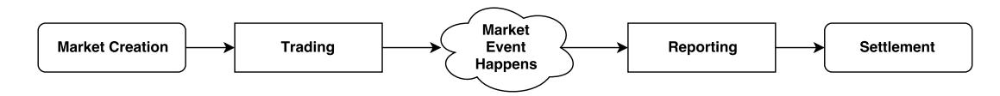
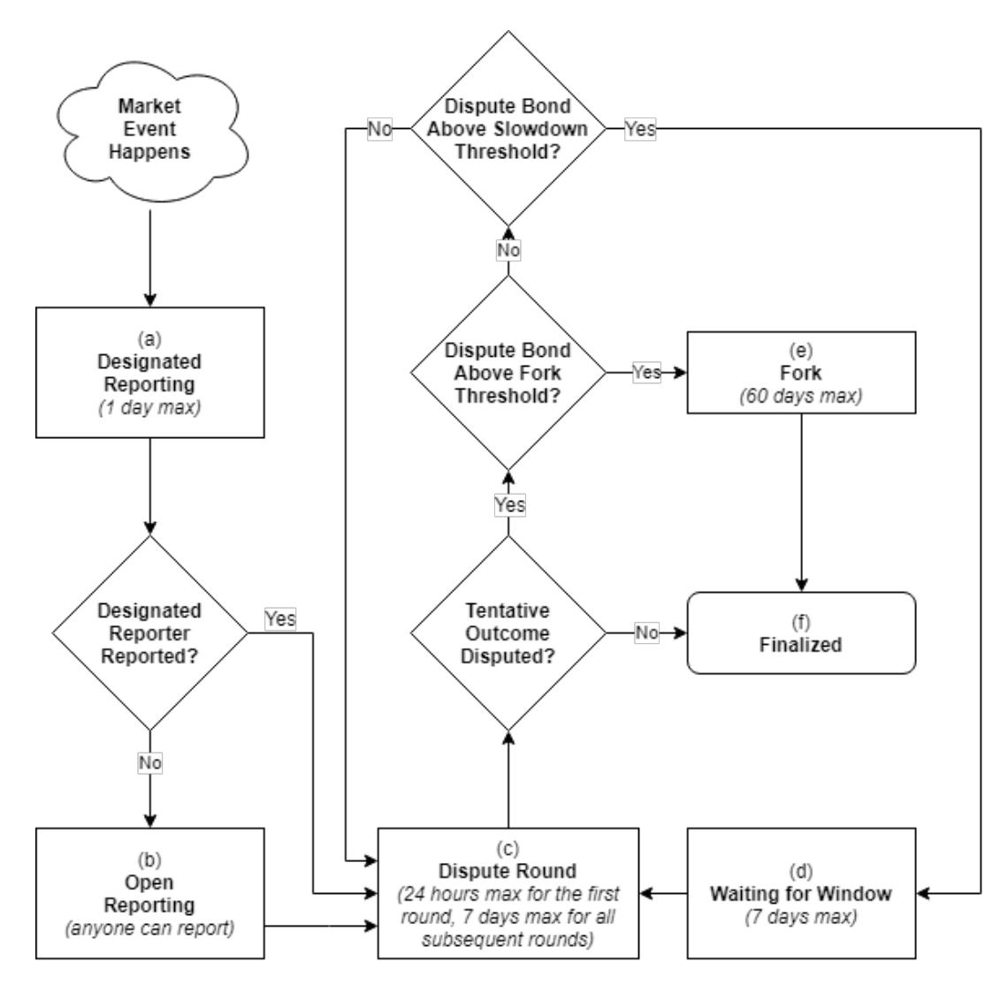

# I. HOW AUGUR WORKS

Augur markets follow a four-stage progression: creation, trading, reporting, and settlement. Anyone can create a market based on any real-world event. Trading begins immediately after market creation, and all users are free to trade on any market. After the event on which the market is based has occurred, the outcome of the event is determined by Augur’s oracle. Once the outcome is determined, traders can close out their positions and collect their payouts. Augur has a native token, Reputation (REP)[^1]. REP is needed by market creators and by reporters when they report on the outcome of markets created on the Augur platform. Reporters report on a market by staking their REP on one of the market’s possible outcomes. By doing this, the reporter declares that the outcome on which the stake was placed matches the real-world outcome of the market’s underlying event. The consensus of a market’s reporters is considered the “truth” for the purpose of determining the market’s outcome. If a reporter’s report of a market’s outcome does not match the consensus reached by the other reporters, Augur redistributes the REP staked on the non-consensus outcome by this reporter to the reporters that reported with the consensus. By owning REP, and participating in the accurate reporting on the outcomes of events, token holders are entitled to a portion of the fees on the platform. Each staked REP token entitles its holder to an equal portion of Augur’s market fees. The more REP a reporter owns, and reports correctly with, the more fees they will earn for their work in keeping the platform secure. Although REP plays a central role in Augur’s operations, it is not used to trade in Augur’s markets. Traders are not required to participate in the reporting process, so they will never need to own or use REP.

*Figure 1. Simplified outline of the lifetime of a prediction market.*

## A. Market Creation

Augur allows anyone to create a market about any upcoming event. The market creator sets the event end time and chooses a designated reporter to report the outcome of the event. The designated reporter does not unilaterally decide the outcome of the market; the community always has an opportunity to dispute and correct the designated reporter’s report. Next, the market creator chooses a resolution source that reporters should use to determine the outcome. The resolution source may simply be “common knowledge”, or it may be a specific source, such as “The United States Department of Energy”, bbc.com, or the address of a particular API endpoint.[^2] They also set a creator fee, which is the fee paid to the market creator by traders who settle with the market contract (see Section I.D for details on fees). Finally, the market creator posts two bonds: the validity bond, and the creation bond. The validity bond is paid in DAI and is returned to the market creator if the market resolves to any outcome other than invalid.[^3] The validity bond incentivizes market creators to create markets based on well-defined events with objective, unambiguous outcomes. The size of the validity bond is set dynamically, based on the proportion of invalid outcomes in recent markets.[^4] The creation bond, paid in REP, is returned to the market creator if and only if the market’s designated reporter actually reports during the first 24 hours after the market’s event end time and if the market ends up resolving to the same outcome that the designated reporter reported. If the designated reporter does not submit their report during the allotted 24 hours window, then the market creator forfeits the creation bond and it is given to the first public reporter who reports on the market (see Section I.C.6). This incentivizes the market creator to choose a reliable designated reporter who will report truthfully – which should help markets resolve quickly. In the event that the designated reporter fails to report, the creation bond is given to the first public reporter in the form of stake on their reported outcome, so that the first public reporter receives the creation bond if and only if they report correctly. As with the validity bond, the creation bond is adjusted dynamically based on the proportion of designated reporters who failed to report on time during the previous dispute window and the proportion of markets that resolve to some outcome other than the one reported by the designated reporter.[^5] The market creator creates the market and posts all required bonds via a single Ethereum transaction. Once the transaction is confirmed, the market is live and trading begins.

## B. Trading

Market participants forecast the outcomes of events by trading shares of those market outcomes. A complete set of shares is a collection of shares that consists of one share of each possible valid outcome of the event [10]. Complete sets are created by Augur’s on-contract matching engine as needed to complete trades[^6]. For example, consider a market that has two possible outcomes, A and B. Alice is willing to pay 0.7 DAI for a share of A and Bob is willing to pay 0.3 DAI for a share of B. First, Augur matches these orders and collects a total of 1 DAI from Alice and Bob.[^7] Then Augur creates a complete set of shares, giving Alice the share of A and Bob the share of B. This is how shares of outcomes come into existence. Once the shares are created, they can be traded freely. The Augur trading contracts maintain an order book for every market created on the platform. Anybody can create a new order or fill an existing order at any time. Orders are filled by an automated matching engine that exists within Augur’s smart contracts. Requests to buy or sell shares are fulfilled immediately if there is a matching order already on the order book. It may be filled by buying shares from or selling shares to other participants, which, may involve issuing new complete sets or closing out existing complete sets. Augur’s matching engine always sequesters the minimum amount of shares and/or cash needed to cover the value at risk. If there is no matching order, or the request can be only partially filled, the remainder is placed on the order book as a new order. Orders are never executed at a worse price than the limit price set by the trader, but may be executed at a better price. Unfilled and partially-filled orders can be removed from the order book by the order’s creator at any time. Fees are paid by traders only when complete sets of shares are sold; settlement fees are discussed in more detail in Section I.D. While most trading of shares is expected to happen before market settlement, shares can be traded any time after market creation. All Augur assets – including shares in market outcomes, participation tokens, shares in dispute bonds, and even ownership of the markets themselves – are transferable at all times. In practice, all of these assets take the form of ERC777 tokens.

## C. Reporting

Once a market’s underlying event occurs, the outcome must be determined in order for the market to finalize and begin settlement. Outcomes are determined by Augur’s oracle, which consists of profit-motivated reporters, who simply report the actual, real-world outcome of the event. Anyone who owns REP may participate in the reporting and disputing of outcomes. Reporters whose reports are consistent with objective reality are financially rewarded, while those whose reports are not consistent with objective reality are financially penalized (see Section I.D.2).

### 1. Dispute Windows

Augur’s reporting system runs on a cycle of consecutive 7-day long dispute windows. All fees collected by Augur during a given dispute window are added to the reporting fee pool for that dispute window. At the end of the dispute window, the reporting fee pool is paid out to REP holders who participated in the reporting process. Reporters receive rewards in proportion to the amount of REP they staked during that dispute window. Participation includes: staking during an initial report, disputing a tentative outcome, or purchasing participation tokens.

### 2. Participation Tokens

During any dispute window, REP holders may purchase any number of participation tokens[^8] for one attorep[^9] each. At the end of the dispute window, they may redeem their participation tokens for one attorep each, in addition to a proportional share of the dispute window’s reporting fee pool. If there were no actions (e.g., submitting a report or disputing a report submitted by another user) needed of a reporter, the reporter may purchase participation tokens to indicate that they showed up for the dispute window. Just like staked REP, participation tokens may be redeemed by their owners for a pro rata portion of fees in this dispute window. Participation tokens are primarily the means by which Augur pays fees to REP holders, but they may also serve as an additional incentive for REP holders to monitor the platform at least once per week. Even REP holders who do not want to participate in the reporting process may be incentivized to check-in with Augur once per 7-day dispute window in order to buy participation tokens and collect fees. This regular, active checking-in will ensure that they are familiar with how to use Augur, will be aware of forks when they occur, and thus should be more ready to participate in forks when they happen.

### 3. Market State Progression

Augur markets can be in seven different states after creation. The potential states, or “phases”, of an Augur market are as follows:

- Pre-reporting
- Designated Reporting
- Open Reporting
- Dispute Round
- Waiting for Window
- Fork
- Finalized
The relationship between these states can be seen in Fig. 2.

*Figure 2. Reporting flowchart.*

### 4. Pre-reporting

The pre-reporting or trading phase (Fig. 1) is the time period that begins after trading has begun in the market, but before the market’s event has come to pass. Generally, this is the most active trading period for any given Augur market. Once the event end date has passed, the market enters the designated reporting phase (Fig. 2a).

### 5. Designated Reporting

When creating a market, market creators are required to choose a designated reporter and post a creation bond. During the designated reporting phase (Fig. 2a) the market’s designated reporter has up to 24 hours to report on the outcome of the event. If the designated reporter fails to report within the allotted 24 hours, the market creator forfeits the creation bond, and the market automatically enters the open reporting phase (Fig. 2b). If the designated reporter submits a report on time then the creation bond is placed as stake on the reported outcome, which will be forfeited if the market finalizes to any outcome other than the one they reported.[^10] As soon as the designated reporter submits its report, the market enters the dispute round phase (Fig. 2c), and the reported outcome becomes the market’s tentative outcome.

### 6. Open Reporting

If the designated reporter fails to report within the allotted 24 hours, the market creator forfeits the creation bond, and the market immediately enters the open reporting phase (Fig. 2b). As soon as the market enters the open reporting phase, anyone can report the outcome of the market. When the designated reporter fails to report, the first reporter who reports on the outcome of a market is called the market’s first public reporter. The market’s first public reporter receives the forfeited creation bond in the form of stake on their chosen outcome, so they may claim the creation bond only if their reported outcome agrees with the market’s final outcome. The first public reporter does not need to stake any of their own REP when reporting the outcome of the market. In this way, any market whose designated reporter fails to report is expected to have its outcome reported by someone very soon after entering the open reporting phase. Once an initial report has been received by the initial reporter (whether it was the designated reporter or first public reporter), the reported outcome becomes the market’s tentative outcome, and the market enters the dispute round phase (Fig. 2c).

### 7. Dispute Round

The dispute round (Fig. 2c) is a phase during which any REP holder has the opportunity to dispute the market’s tentative outcome. A dispute round may last up to 7 days (with the exception of the very first dispute round, which may last up to 24 hours). At the beginning of a dispute round, a market’s tentative outcome is the outcome that will become the market’s final outcome if it is not successfully disputed by REP holders. A dispute consists of staking REP (referred to as dispute stake in this context) on an outcome other than the market’s current tentative outcome. A dispute is successful if the total amount of dispute stake on some outcome meets the dispute bond size required for the current round. The dispute bond size is computed as follows. Let $A_n$ denote the total stake over all of this market’s outcomes at the beginning of dispute round $n$. Let $\omega$ be any market outcome other than the market’s tentative outcome at the beginning of this dispute round. Let $S(\omega,n)$ denote the total amount of stake on outcome $\omega$ at the beginning of dispute round $n$. Then the size of the dispute bond needed to successfully dispute the current tentative outcome in favor of the new outcome $\omega$ during round $n$ is denoted $B(\omega,n)$ and is given by:

$$
B(\omega,n) = 2A_n - 3S(\omega,n) \tag{1}
$$

The bond sizes are chosen this way to ensure a fixed ROI for reporters who successfully dispute false outcomes (see Section II.D). The dispute bonds need not be paid in their entirety by a single user. The Augur platform allows participants to crowdsource dispute bonds. Any user who sees an incorrect tentative outcome can dispute that outcome by staking REP on an outcome other than the tentative outcome. If any outcome (other than the tentative outcome) accumulates enough dispute stake to fill its dispute bond, the current tentative outcome will be successfully disputed. In the case of a successful dispute, One of three things will happen: the market will either undergo another dispute round immediately, the market will wait until the next dispute window begins before undergoing another dispute round, or the market will enter the fork state (Fig. 2e). If the size of the filled dispute bond is greater than or equal to 2.5% of all theoretical REP[^11], then the market will enter the fork state. If the size of the filled dispute bond is less than 2.5% of all theoretical REP but greater than or equal to 0.02% of all theoretical REP, then the newly chosen outcome becomes the market’s new tentative outcome and the market enters the waiting for window phase (Fig. 2d). If the size of the filled dispute bond is less than 0.02% of all theoretical REP, then the newly chosen outcome becomes the market’s new tentative outcome and the market immediately enters another dispute round. All dispute stake is held in escrow during the dispute round. If a dispute bond is unsuccessful, then the dispute stake is returned to its owners at the end of the dispute round. If no dispute is successful during the dispute round, then the market enters the finalized state (Fig. 2f), and its tentative outcome is accepted as its final outcome. A market’s final outcome is the tentative outcome that passes through a dispute round without being successfully disputed, or is determined via a fork. Augur’s contracts treat final outcomes as truth and pay out accordingly. All unsuccessful dispute stake is returned to the original owners at the end of every dispute round. All successful dispute stake is applied to the outcome it championed, and remains there until the market is finalized (or until a fork occurs in some other Augur market). All dispute stake (whether successful or unsuccessful) will receive a portion of the reporting fee pool[^12] from the current dispute window.

### 8. Waiting for Window

If a market’s tentative outcome is disputed with a bond greater than or equal to 0.02% of all theoretical REP but less than 2.5% of all theoretical REP, then the market enters the waiting for window phase (Fig. 2d), before undergoing another dispute round. The purpose of this is simply to slow down the dispute process as the bonds get larger – giving honest participants more time to crowdfund the larger dispute bond. This reduces the risk of a critical failure mode: one where the oracle resolves incorrectly because honest participants didn’t have time to raise the funds needed to dispute a false tentative outcome. During this phase, reporting for the market is on hold until end of the current dispute window. Once the next dispute window begins, the market enters the dispute round phase.

### 9. Fork

The fork state (Fig. 2e) is a special state that lasts up to 60 days. Forking is the market resolution method of last resort; it is a very disruptive process and is intended to be a rare occurrence. A fork is caused when there is a market with an outcome with a successfully-filled dispute bond of at least 2.5% of all theoretical REP. This market is referred to as the forking market. When a fork is initiated, a 60-day[^13] forking period begins. Disputing for all other non-finalized markets is put on hold until the end of this forking period. The forking period is much longer than the usual dispute window because the platform needs to provide ample time for REP holders and service providers (such as wallets and exchanges) to prepare. A fork’s final outcome cannot be disputed. Every Augur market and all REP tokens exist in some universe. REP tokens can be used to report on outcomes (and thus earn fees) only for markets that exist in the same universe as the REP tokens. When Augur first launches, all markets and all REP will exist together in the genesis universe. When a market forks, new universes are created. Forking creates a new child universe for each possible outcome of the forking market (including Invalid). For example, a “Yes/No” market has 3 possible outcomes: Yes, No, and Invalid. Thus, a “Yes/No” forking market will create three new child universes: universe Yes, universe No, and universe Invalid. Initially, these newly created universes are empty: they contain no markets or REP tokens. When a fork is initiated, the parent universe becomes permanently locked. In a locked universe, no new markets may be created and no REP can be staked on any market. Therefore markets in a locked universe cannot be finalized. However users may continue trading shares in markets in locked universes. In order for markets or REP tokens in the locked universe to be useful, they must first be migrated to a child universe. During the forking period, holders of REP tokens in the parent universe may migrate their tokens to a child universe of their choice. This choice should be considered carefully, because migration is one-way; it cannot be reversed. Tokens cannot be sent from one sibling universe to another. Migration is a permanent commitment of REP tokens to a particular outcome of the forking market. REP tokens that migrate to different child universes ought to be considered entirely separate tokens, and service providers like wallets and exchanges ought to list them as such. Any REP tokens that have not been migrated out of the parent universe 60 days after the fork started will be permanently locked in the parent universe. Such tokens are expected to lose all value, so it is of paramount importance that REP holders migrate their tokens anytime a fork happens. When a fork is initiated, all REP staked on all non-forking markets is unstaked so that it is free to be migrated to a child universe during the forking period.[^14] Whichever child universe receives the most migrated REP by the end of the forking period becomes the winning universe, and its corresponding outcome becomes the final outcome of the forking market. Un-finalized markets in the parent universe may be migrated only to the winning universe and, if they have received an initial report, are reset back to the waiting for window phase.

**Reporters that have staked REP on one of the forking market’s outcomes cannot change their position during a fork.** REP that was staked on a forking market’s outcome in the parent universe can be migrated only to the child universe that corresponds to that outcome. For example, if a reporter helped fulfill a successful dispute bond in favor of outcome A during some dispute round, then the REP they have staked on outcome A can only be migrated to universe A during a fork.

**Sibling universes are entirely disjoint.** REP tokens that exist in one universe cannot be used to report on events or earn rewards from markets in another universe. Since users presumably will not want to create or trade on markets in a universe whose oracle is untrustworthy, REP that exists in a universe that does not correspond to objective reality is unlikely to earn its owner any fees, and therefore should not hold any significant market value. Therefore, REP tokens migrated to a universe which does not correspond to objective reality should hold no market value, regardless of whether or not the objectively false universe ends up being the winning universe after a fork. This has important security consequences, which we discuss in Section II.

### 10. Finalized

A market enters the finalized state (Fig. 2f) if it passes through a 7-day dispute round without having its tentative outcome successfully disputed, or after completion of a fork. The outcome of a fork cannot be disputed and is always considered final at the end of the forking period.

Once a market is finalized, traders can settle their positions directly with the market. When a market enters the finalized state, we refer to its chosen outcome as the final outcome.

## D. Market Settlement

A trader can close their position in one of two ways: by selling the shares they hold to another trader in exchange for currency, or by settling their shares with the market. Recall that every share comes into existence as part of a complete set when a total of 1 DAI has been escrowed with Augur.[^7] To get that 1 DAI out of escrow, traders must give Augur either a complete set or, if the market has finalized, a share of the winning outcome. When this exchange happens we say traders are settling with the market contract. For example, consider a non-finalized market with possible outcomes A and B. Suppose Alice has a share of outcome A that she wants to sell for 0.7 DAI and Bob has a share of outcome B that he wants to sell for 0.3 DAI. First, Augur matches these orders and collects the A and B shares from the participants. Then Augur gives 0.7 DAI (minus fees) to Alice and 0.3 DAI (minus fees) to Bob. As a second example, consider a finalized market whose winning outcome is A. Alice has a share of A and wants to cash it in. She sends her share of A to Augur and in return receives 1 DAI (minus fees).

### 1. Settlement Fees

The only time Augur levies fees is when market participants are settling with the market contract. Augur levies two fees during settlement: the creator fee, and the reporting fee. Both of these fees are proportional to the amount being paid out. So, in the pre-finalized settlement example above, where Alice receives 0.7 DAI and Bob receives 0.3 DAI, Alice would pay 70% of the fees while Bob would pay 30%. The creator fee is set by the market creator during market creation, and is paid to the market creator upon settlement. The reporting fee is set dynamically (see Section II.C) and is paid to reporters who participate in the reporting process.

### 2. Reputation Redistribution

If a market finalizes without initiating a fork, all REP staked on any outcome other than the market’s final outcome is forfeited. Twenty percent of the forfeited stake is burned, and the remainder is distributed to the users who staked on the market’s final outcome in proportion to the amount of REP they staked. The dispute bond sizes and the amount burned are chosen such that anyone who successfully disputes an outcome in favor of the market’s final outcome is rewarded with a 40% ROI on their dispute stake.[^15] This is a strong incentive for reporters to dispute false tentative outcomes.

[^1]: REP is an ERC777 token on the Ethereum network.
[^2]: For example, if a market on “The high temperature (in degrees Fahrenheit) on April 10, 2018 at the San Francisco International Airport, as reported by Weather Underground” specifies a resolution source of https://www.wunderground.com/history/airport/KSFO/2018/4/10/DailyHistory.html, reporters would simply go to that URL and enter the high temperature displayed there as their report.
[^3]: An invalid market is a market determined to be invalid by reporters because none of the outcomes listed by the market creator is correct, or because the market wording is ambiguous or subjective; see Section III.G for discussion.
[^4]: See Appendix B1 for details.
[^5]: See Appendix B2 for details.
[^6]: In practice, each share in a complete set is an ERC777 token on the Ethereum network.
[^7]: The 1 DAI figure is used here for ease of discussion. The actual cost of a complete set of shares is much smaller than this; see docs.augur.net/#number-of-ticks for details.
[^8]: Participation tokens are ERC777 tokens on the Ethereum network.
[^9]: One attorep is $10^{-18}$ REP.
[^10]: Forfeited stake is used to reward honest reporters and disputers; see Section I.D.2 for details.
[^11]: All theoretical REP means the total theoretical supply of REP in the univese. In other words, Sum of the total amount of REP which exist in the universe and the total amount of REP which exist in the other universe and can be migrated to the universe.
[^12]: Any reporting fees and validity bonds collected during a dispute window get added to that dispute window’s reporting fee pool. At the end of the dispute window, the reporting fee pool is paid out to users in proportion to the amount of REP they staked during that dispute window.
[^13]: Forking periods can be less than 60 days: a forking period ends when either 60 days have passed, or more than 50% of all theoretical REP is migrated to some child universe. However even after the end of a forking period, REP in the parent universe can be migrated to the child universe if it is within 60 day of fork initiation.
[^14]: The only exception is the REP staked by the initial reporter when they made the initial report. That REP remains staked on the initial reported outcome and is automatically migrated to the child universe that wins the fork. This happens for technical reasons unrelated to the mechanism design.
[^15]: See Theorem 2 in Appendix A.
